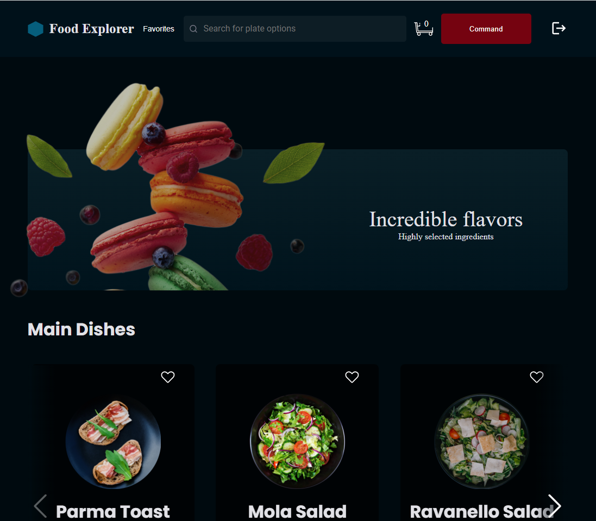

<h1 align='center'>
     Food Explorer - Rocketseat 
</h1>

## 💻 About

The application is a digital menu for a fictional restaurant, foodExplorer.

I used the following topics:

- React;
- Routes;
- components;
- Props;
- hooks;
- context;
---

## ⚙️ Layout

 

---

## ⚙️ Features

- Application developed based on a <a href='https://www.figma.com/file/GkqG5AUJe3ppcUEHfvOX6z/food-explorer' target='_blank'> Figma </a> project
- A structured project, with a good organization of folders, division of components in the front-end, etc.
- A README.md file with specifications on how to run the project in a dev environment.
- Users must authenticate themselves to enter the application through the login screen, you can apply what you learned in JWT authentication classes. Authentication must be validated with a password.
- Admin can add or delete an dish or edit an existing dish.
- Give your functions and variables meaningful names: work with Clean Code concepts a bit.
- Admin, dishes and users data will be stored in a database.
- Possibility to search by dish name, ingredients or favorite dish.
- With CSS, I created some animations like hover and button click.
- User can add items to the cart by clicking the add button. The amount is controlled by the “-” and “+” buttons;
- Clicking on Cart, the user will be redirected to a screen where he will see his order, the sum and the payment methods;
- User will be able to delete a dish from the cart and the total amount of the order should be updated automatically;
- User can mark a dish as a favorite, just click on the heart that appears next to each one;
- Admin will view and control the status of each order, through a select field. Orders will appear in a table when you click Orders;
---

### Deploy
[Food Explorer](https://foodexplorer-23.netlify.app/)

---

## 🚀 How it works

This project is divided into two parts:
1. Backend (food-explorer-backend folder) 
2. Frontend (foodexplorer_API folder)

💡 The Frontend needs the Backend to be running to work.

### Pre-requisites
Before you begin, you will need to have the following tools installed on your machine: [Git] (https://git-scm.com), [Node.js] (https://nodejs.org/en/). In addition, it is good to have an editor to work with the code like [VSCode] (https://code.visualstudio.com/)

#### 🎲 Running the Server (Backend)

```bash
# Clone this repository
$ git clone https://github.com/HenriquedaFonte/foodexplorer_API.git

# Access the project folder in your terminal
$ cd foodexplorer_API

# Install the dependencies
$ npm install

# run the migration and seed
$ npm migrate
$ npm seed

# Run the application in development mode
$ npm run dev

# Admin login
$ email: admin@email.com
$ password: 123

# The Server will start at port: 3333 - go to http://localhost:3333
```
---

#### 🧭 Running the web application (Frontend)

```bash
# Clone this repository
$ git clone https://github.com/HenriquedaFonte/foodexplorer_front.git

# Access the project folder in your terminal
$ cd foodexplorer_front

# Install the dependencies
$ npm install

# Run the application in development mode
$ npm run dev

```
---

## 🛠 Tech Stack

The following tools were used in the construction of the project:
- [React](https://reactjs.org)
- [HTML](https://developer.mozilla.org/pt-BR/docs/Web/HTML)
- [Styled components](https://styled-components.com/)
- [JavaScript](https://developer.mozilla.org/pt-BR/docs/Web/JavaScript)

---

## 🦸 Author

<a href='https://github.com/HenriquedaFonte'>
  
 <br/>
 <sub><b>Henrique da Fonte</b></sub>
</a> 

---

## 📝 License

This project is under the license [MIT](./LICENSE).

Made by Henrique da Fonte 👋🏽 [Get in Touch!](https://www.linkedin.com/in/henrique-da-fonte-6b5615b3/)

---
